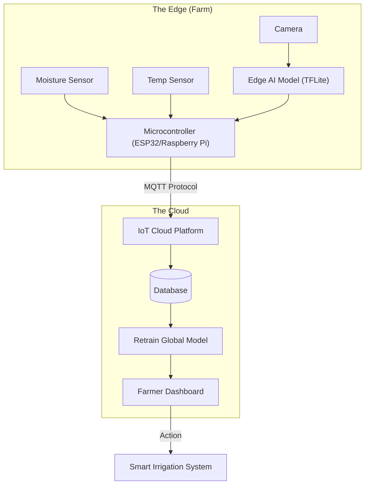

# Pioneering Tomorrow’s AI Innovations

**Assignment:** AI Future Directions
**Author:** FADHILI ANICETUS

---

## Part 1: Theoretical Analysis

### Q1: Edge AI vs. Cloud AI

**How Edge AI reduces latency and enhances privacy:**

- **Latency Reduction:** Traditional Cloud AI sends data to a central server, processes it, and sends the result back. This round-trip creates a delay (latency). Edge AI processes data locally on the device (e.g., a camera or sensor) itself. Since the data doesn't travel over the internet, decisions happen in milliseconds.
- **Privacy Enhancement:** In Cloud AI, user data (video feeds, voice commands) is often stored on third-party servers, raising hacking or surveillance risks. Edge AI keeps sensitive raw data on the device; only the final "insight" (e.g., "intruder detected") is shared, preserving user anonymity.

**Real-World Example:**

- **Autonomous Drones:** A drone navigating a forest cannot afford the delay of sending video to the cloud to ask "is this a tree?" If the internet connection lags, the drone crashes. Using Edge AI, the drone processes obstacles instantly onboard, ensuring safety even without Wi-Fi.

### Q2: Quantum AI vs. Classical AI

**Comparison in Optimization:**

- **Classical AI:** Solves problems sequentially or with limited parallelism. As variables increase (e.g., finding the best route for 1,000 trucks), the calculation time grows exponentially, eventually becoming impossible to solve.
- **Quantum AI:** Uses "qubits" which can exist in multiple states at once (superposition). This allows Quantum AI to evaluate billions of potential solutions _simultaneously_ rather than one by one, finding the optimal solution in seconds where classical computers might take years.

**Industries Benefiting Most:**

1.  **Pharmaceuticals:** Simulating molecular interactions to discover new drugs.
2.  **Logistics & Supply Chain:** Optimizing global shipping routes to reduce fuel and time.
3.  **Finance:** Portfolio optimization and fraud detection in complex markets.

---

## Part 2: Practical Implementation

### Task 2: AI-Driven IoT Concept (Smart Agriculture)

**Scenario:** A system to optimize crop yields using real-time soil data.

#### 1. Sensors Needed

- **Capacitive Soil Moisture Sensor:** To measure water content at root level.
- **NTC Thermistor:** To monitor soil and ambient temperature.
- **NPK Sensor:** To detect Nitrogen, Phosphorus, and Potassium nutrient levels.
- **Optical/Camera Sensor:** To visually detect pest infestations or leaf discoloration.

#### 2. Proposed AI Model

- **Model Type:** **Random Forest Regressor** (or LSTM for time-series data).
- **Why:** We want to predict a continuous value (Crop Yield in kg). Random Forest is excellent for this because it handles non-linear relationships between variables (e.g., high temp + low water = bad yield) and is robust against noise in sensor data.

#### 3. Data Flow Diagram

The diagram below illustrates how data moves from the farm to the actionable insight.

